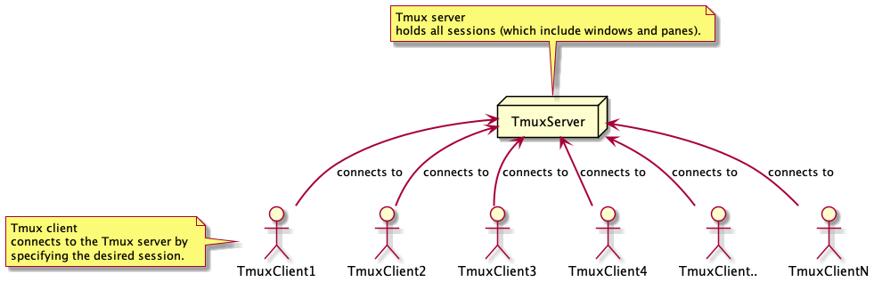

# Tmux
Tmux is one of the tools I feel that I found too late in my career. It is one of the life savers which should be under the tool belt of anyone working in a day-to-day computer industry job. Let me explain the why but before the *what?!*

Simply put, Tmux is a **Terminal Mutliplexer**. That means it combines **multiple** terminals and displays those **as just one**. Which is in the beginning something similiar to a simple split in our terminal of choice(e.g. iTerm, kitty, ..)  but Tmux goes even further than this. Through its nature to be build upon a **client <-> server architecture** multiple clients can connect to those terminals or the client can detach from the terminal and come back at anytime and the processes are still running.



This was for me one huge selling point for Tmux. Think about this: How often did you accidently closed a terminal with an important running process and just killed it through this hasty reaction or the connection dropped while ssh'ing into a server with multiple terminals open to troubleshoot things or performing a massive update on the machine.

With Tmux this scenarios are non existing.

**The building blocks of Tmux are sessions, windows and panes and the Prefix**. We will first follow a simple example of a day-to-day usage of Tmux and after this we will break down each part and discuss what just happend.

## Instructions

- Run the following command in your shell `tmux new -s privat/tmux`
- A new window should pop up (don't be concerned about this now), press the **Control and the b** keys together, release them and press the colon (:) key
- Your cursor just jumped to the bottom of the window (we just entered something called *Command Mode* and we will come back to this later), enter the text `new-window` and press enter
- In the new window press the *Control and the b* keys together, release them and press the c key
- Start `htop` in the current window by typing `htop` command and press enter
- Now press again the *Control and the b* keys together, release them and press the percent (%) key
- We just split the terminal horizontly and can run another command on this terminal (e.g. on macOS run the following command to see the current system logs `tail -F /var/log/system.log`)
- Press now  *Control and b* keys together, release them and press the o key
- Press the q button to close `htop`
- Press now  *Control and b* keys together, release them and press the d key
- We are now back in our initial terminal, run the following command in your shell `tmux ls`
- We now see an output mentioning something like **privat/tmux: 3 windows (created ... )**
- To finish things up, run the following command in you shell `tmux kill-server`
- Run again the `tmux ls` command; this time we just get the information that no server is running

Now we just walkthrough some basic commands but didn't know what really happend there. Lets take each command and take it apart and understand it.

## The inner workings explained!

### tmux new -s privat/tmux
As mentionend before, Tmux is based on a **client <-> server architecture**, so in the beginning we need to start the server process somehow. In the intial state there is no server running but with the command `tmux new` we are starting it besides creating the first **session** on the system. So a the first session automaticcaly starts also the server. A session is named collection of windows. This makes it also possible for other client to connect to the session, by refering to its name. Yes, this makes even pair programming possible via Tmux!

After triggering the command we will see the Terminal output changed and suddenly we have a status bar (depending on your configuration it is placed on different localtions, default to bottom of page). We can also see the name of our session here.

// Todo, default status bar


// Todo, customize status bar


So now we have a session called **privat/tmux** containing one window. A window is the displayed full-screen representation of the current terminal. Currently we have one window, just with one terminal. Nothing fancy ... so far 😃

// Todo, look up window defintion form docs

### Control and the b
If we look closely we see that the focus is immediately within the only terminal and we can type commands as usual but what if we want to talk to Tmux instead (e.g. trigger commands, copy text, ..)?

This is done by first sending a dedicated keybinding called **the prefix**. You can think of a way to say: *Ok, system. I now want to talk to Tmux not you*. So after executing the prefix Tmux is listening for other commands and will react on those (on a sidenote this span how long Tmux will react on your next command can be configured if you want to).

The default prefix keybinding is pressing the Control key together with the b key (lowercase). Due to this is for most people a strange combination (e.g. people using editors like Vim :) ). The prefix got often reconfigured to be more user friendly. Thats why you mostly see that people are just referring to `PREFIX $ANOTHER_KEYBINDING`. Always remember that the prefix needs to be triggered befor the following keybinding. So for example:

`PREFIX d`

should be read as 

`CONTROL + b together, release, d key afterwards`. So lets see what our first command to Tmux is actually about.

### PREFIX :
We just pressed the Prefix followed by a colon. This let the cursor jump to the bottom (this could be somewhere else to depending on your configuration) and now we have the chance to type in commands in the status bar.

// todo picture of command mode

We are now in the Tmux `Command Mode` and that it all is here. As described, one part of Tmux is a server and can receive commands. There are several commands to explore but we will use just one to get a feeling of it next.

### new-window Command
A session consist just of one window in the beginning, so we just triggered to create a new window with `new-window`.

// todo talk about window names

### PREFIX c
Lets recap:

* We have a session called `privat/tmux`
* It consisten of two windows

So now when we trigger the next command to the Tmux server, `PREFIX c`, another window is created! This means we can use the `Command Mode` or simply run specific keybindings to achieve the same. Nice!

To see all keybindings like this just enter `PREFIX ?` and you will see the full list. Simply press the q key to leave it again.

### Running htop and triggering PREFIX %
We should be now in the thirds created window (this will be displayed to us via the Status Bar). We run an arbitary command, I justed htop but you can run anything interesting like tailing growing logs.

Next we triggered `PREFIX %` which will perform a horizontly split. That mean now we have 2 terminals in our window. In Tmux lingo we have a window containing two panes! So a pane is simply a new terminal. We can also run here new commands side-by-side with the other terminal.

// Todo pane defintion from documentation

### PREFIX o
Tmux always choose to set the focus to the most recently created object when it comes to windows or panes. So we need to find a way to move between panes. This is exactly what `PREFIX o` is doing. It let us rotate through the panes of the current window.

Another way is to use `PREFIX $CURSOR_KEY` (e.g. PREFIX UP, PREFIX DOWN, ..) to move to dedicated panes.

### PREFIX d
I can't mention it enough: Tmux contains of a server (to be honest they can even be more servers but this is more advanced) and multiple clients connecting to it. The command `PREFIX d` lets us detach from the current session we are in. After the command execution, we find ourselves again in the **normal** terminal. But the server is **still running**. That means all processes we started are continuing and nothing is lost!

To reattach to a session we could use the command `tmux attach -t privat/tmux` and are back in business.

// todo run multple tmux server on one system

### tmux ls
Sometimes you just want to know what kind of sessions are running right now on the system. So the `tmux ls` command is telling us exactly this:

* names of running sessions
* number of windows inside of those sessions
* and more

// todo what does tmux ls really shows?

### tmux kill-server

If you really want to kill all sessions for whatever reason, the command `tmux kill server` will do exactly this. It will tear down the server with all of its sessions.

## Prefix
When Tmux get started, that means the first session is started, the client can send commands to the server to trigger specific actions. While it is nice to issue commands into Tmux from the outside 

## Session
A session is a collection of windows. Take for example the task to opening and running your application code and simultanously looking at the tables of your database. In the Tmux universe you would simple create a session with two windows, one for your application code and the other for the database server connection.

A session can have a dedicated name. Currently I am following the pattern of `{work|privat}/$PROJECT_NAME`.

### Create a new session
To create a new session we call Tmux with the `new` command and optionally define a session name (it is also possible to define a command to trigger immediately within the new window but *be aware* of the behaviour of tmux to close the session if this initial process exists):

```
tmux new -s privat/notebook
```

This command will create a new session called `privat/notebook`.

## Windows
A window can have a name which can be changed to your needs, we will come back later to this.

## Panes
| 1 | 2 |
|---|---|
| 3 | 4 |
